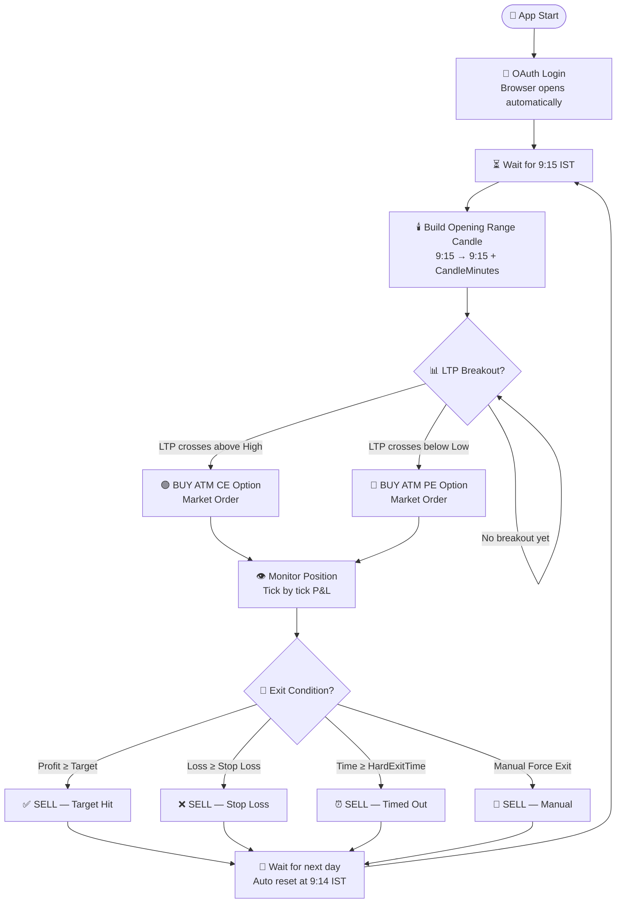
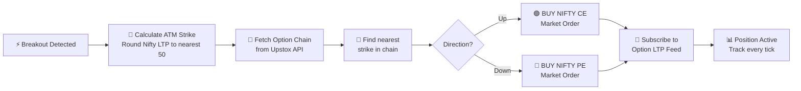
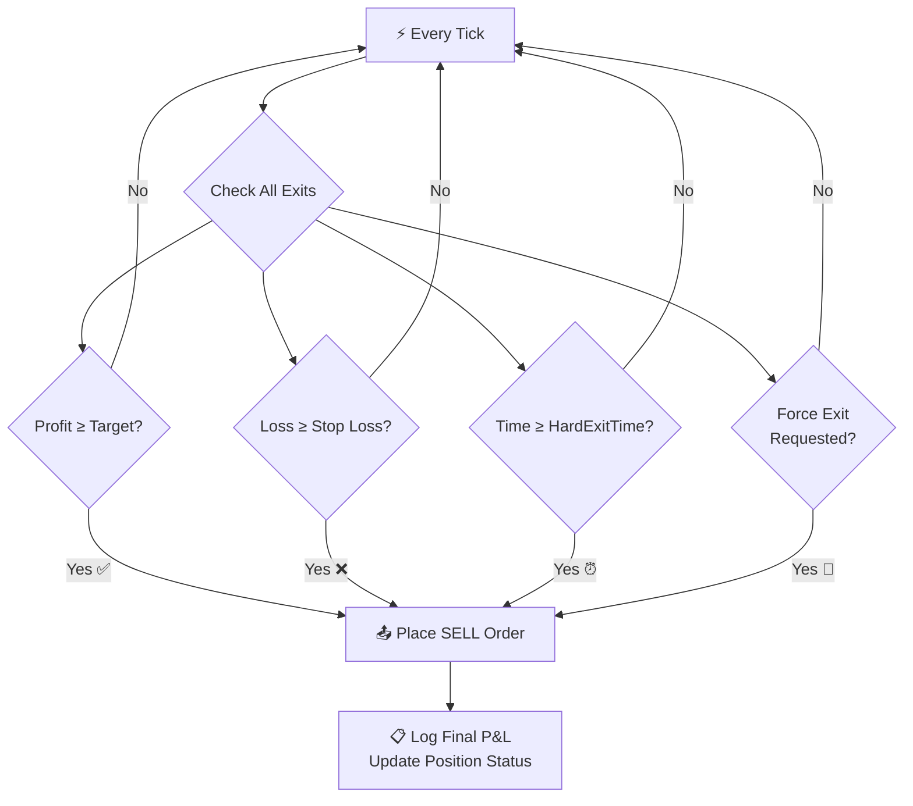
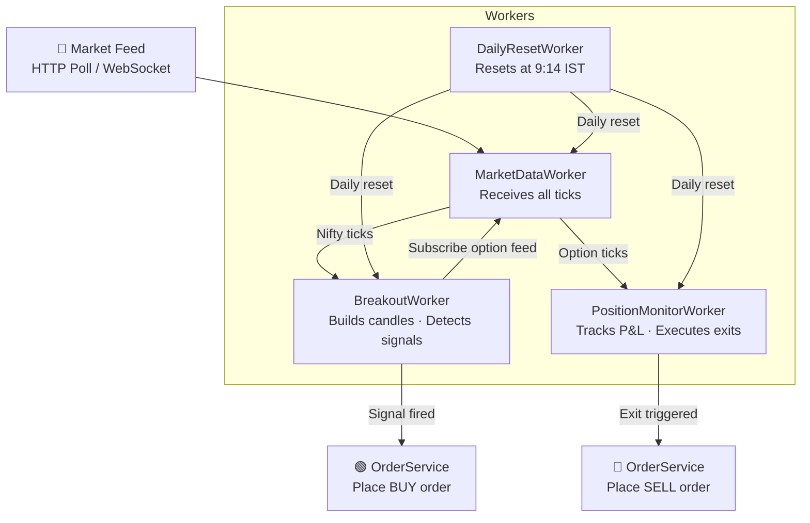

<div align="center">

# 📈 UpstoxTrader

### Automated Opening Range Breakout (ORB) Trading Bot
#### Nifty 50 Options · Upstox API · .NET 8

<br/>


</div>

---

## 📌 What Is This?

UpstoxTrader is a fully automated trading bot that implements the **Opening Range Breakout (ORB)** strategy on Nifty 50 options using the Upstox API. It builds an opening candle, detects a price breakout, places a market order, monitors P&L tick-by-tick, and exits automatically — all without manual intervention.

---

## 🔄 Overall Trading Flow



---

## 🕯️ The Opening Range Candle

The bot watches Nifty price for the first N minutes. The High and Low of that window become the **Opening Range**.

```
Nifty Price
    │
    │              ╔══ Breakout Above High → 🟢 BUY CE ══════▶
    │              ║
 High ─────────────╫─────────────────────────────────────────
    │         ┌────╨────┐
    │         │  O R B  │  Opening Range Candle
    │         │  Candle │  tracks High / Low / Open / Close
    │         └────╥────┘
 Low  ─────────────╫─────────────────────────────────────────
    │              ║
    │              ╚══ Breakout Below Low  → 🔴 BUY PE ══════▶
    │
    └──────────────────────────────────────────────────────▶ Time
              9:15  9:17                            15:20
              │◄──►│
           CandleMinutes
```

---

## 📥 Order Placement Logic



---

## 🚪 Exit Conditions



<details>
<summary><b>📐 Exit mode formula reference</b></summary>

<br/>

| `ExitMode` | Target condition | Stop loss condition |
|---|---|---|
| `Percent` | `(LTP - Entry) / Entry × 100 ≥ TakeProfitPct` | `(Entry - LTP) / Entry × 100 ≥ StopLossPct` |
| `Points` | `LTP - Entry ≥ TakeProfitPoints` | `Entry - LTP ≥ StopLossPoints` |

</details>

---

## 🏗️ System Architecture



---

## ⚙️ Prerequisites

> **Only one install required**

| Requirement | Details |
|---|---|
| [.NET 8 SDK](https://dotnet.microsoft.com/download/dotnet/8.0) | Download the **SDK** (not Runtime) for Windows x64 |

Verify after install:
```bash
dotnet --version   # should print 8.x.x
```

---

## 🚀 Setup Guide

### Step 1 — Upstox Developer Portal

1. Log in at [developer.upstox.com](https://developer.upstox.com)
2. Go to **My Apps** → **Create New App**
3. Set the **Redirect URL** to exactly:
   ```
   http://localhost:5000/callback/
   ```
4. Enable scopes: `orders` `portfolio` `feed` `user`
5. Copy your **Client ID** and **Client Secret**

---

### Step 2 — Get the Code

Download the ZIP from GitHub → **Code → Download ZIP** → Extract to `C:\UpstoxTrader`

---

### Step 3 — Configure

Open `src\UpstoxTrader.Worker\appsettings.json` and set your credentials:

```json
"Upstox": {
  "ClientId":     "YOUR_CLIENT_ID",
  "ClientSecret": "YOUR_CLIENT_SECRET",
  "RedirectUri":  "http://localhost:5000/callback/"
}
```

---

### Step 4 — Run

```bash
cd src\UpstoxTrader.Worker
dotnet run
```

> First run downloads packages automatically (internet required, one-time only).
> A browser opens for Upstox login. After approval, the bot starts and waits for 9:15.

---

## 🛠️ Configuration Reference

<details>
<summary><b>📡 Upstox API settings</b></summary>

<br/>

| Key | Description |
|-----|-------------|
| `Upstox:ClientId` | From Upstox developer portal |
| `Upstox:ClientSecret` | From Upstox developer portal |
| `Upstox:RedirectUri` | Must match exactly what is set in developer portal |
| `Upstox:BaseUrl` | `https://api.upstox.com/v2` — do not change |
| `Upstox:WebSocketUrl` | Upstox market feed URL — do not change |

</details>

<details>
<summary><b>📊 Trading settings</b></summary>

<br/>

| Key | Default | Description |
|-----|---------|-------------|
| `Trading:CandleMinutes` | `2` | Opening range window in minutes |
| `Trading:CandleMode` | `AllCandles` | `FirstOnly` — one signal per day; `AllCandles` — re-arm after each candle |
| `Trading:SignalCutoffTime` | `"15:00"` | Stop looking for signals after this IST time (`AllCandles` mode) |
| `Trading:LotSize` | `75` | Shares per order — verify current Nifty lot size on NSE |
| `Trading:ExitMode` | `Percent` | `Percent` or `Points` |
| `Trading:TakeProfitPct` | `10.0` | Target profit % (`Percent` mode) |
| `Trading:StopLossPct` | `5.0` | Stop loss % (`Percent` mode) |
| `Trading:TakeProfitPoints` | `10` | Target profit in points (`Points` mode) |
| `Trading:StopLossPoints` | `5` | Stop loss in points (`Points` mode) |
| `Trading:HardExitTime` | `"15:20"` | Force-exit all positions at this IST time |
| `Trading:PaperTrade` | `true` | `true` = simulated; `false` = live real orders |

</details>

<details>
<summary><b>📈 Nifty settings</b></summary>

<br/>

| Key | Default | Description |
|-----|---------|-------------|
| `Nifty:InstrumentKey` | `NSE_INDEX\|Nifty 50` | Upstox instrument key — do not change |
| `Nifty:StrikeInterval` | `50` | Strike rounding interval |

</details>

---

## 📄 Paper vs Live Trading

| | 🧪 Paper | 💰 Live |
|---|---|---|
| `PaperTrade` | `true` | `false` |
| Real orders placed | No | Yes |
| P&L tracking | Simulated from ticks | Real |
| Logs | Same | Same |

> ⚠️ **Always run Paper first** to confirm expiry, strike, and direction are correct before going live.

To go live:
1. Set `"PaperTrade": false`
2. Verify `LotSize`, `TakeProfitPct`, `StopLossPct`
3. Restart the bot

---

## 📋 Logs

<details>
<summary><b>View log format and key messages</b></summary>

<br/>

Logs are written to `logs/upstox-YYYYMMDD.log` and the console.
Format: `[HH:mm:ss INF] Message`

**On startup:**
```
Opening browser for Upstox OAuth...
Access token obtained — ready to trade
Option chain session: underlying=NSE_INDEX|Nifty 50 expiry=2026-05-13
```

**During trading:**
```
Breakout detected: CE | Nifty @ 24150
Placed BUY order: NSE_FO|NIFTY...
P&L: +6.2% | ₹4,800
Exit: Target Hit | Sell order placed
```

</details>

---

## 📁 Solution Structure

```
UpstoxTrader/
├── 📄 README.md
├── 📄 UpstoxTrader.sln
└── src/
    ├── UpstoxTrader.Core/            Models · Interfaces · Settings · Enums
    ├── UpstoxTrader.Infrastructure/  Auth · WebSocket · HTTP client · Order & Option services
    ├── UpstoxTrader.Strategy/        Candle builder · Breakout detector · Exit evaluator
    └── UpstoxTrader.Worker/          Background workers · Startup · appsettings.json
```

---

## ⚠️ Important Notes

- Each person must use their **own Upstox API credentials** — never share across machines
- `FirstOnly` mode: **one trade per day**, no re-entry after exit
- `AllCandles` mode: re-arms after each candle closes, one position active at a time
- All state is **in-memory** — restarting mid-day resets everything
- If started **after 9:30 IST**, the bot auto-seeds the opening candle from historical data
- Press `Ctrl+C` to stop the bot

---

<div align="center">

Built with ❤️ using .NET 8 · Not financial advice · Trade responsibly

</div>
