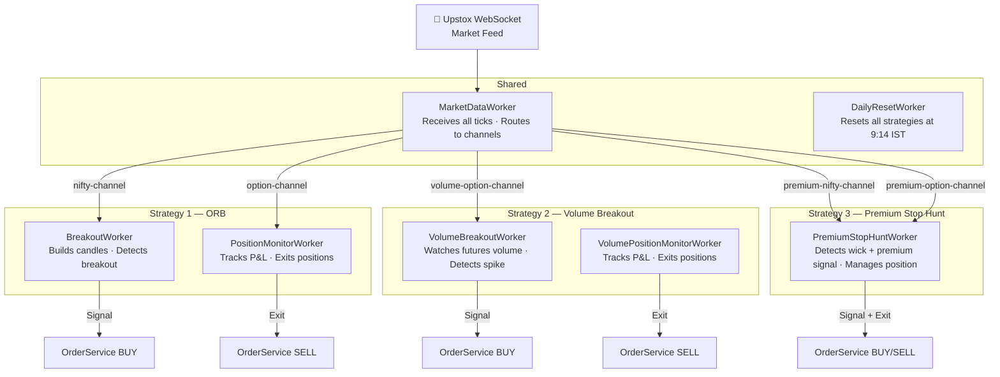
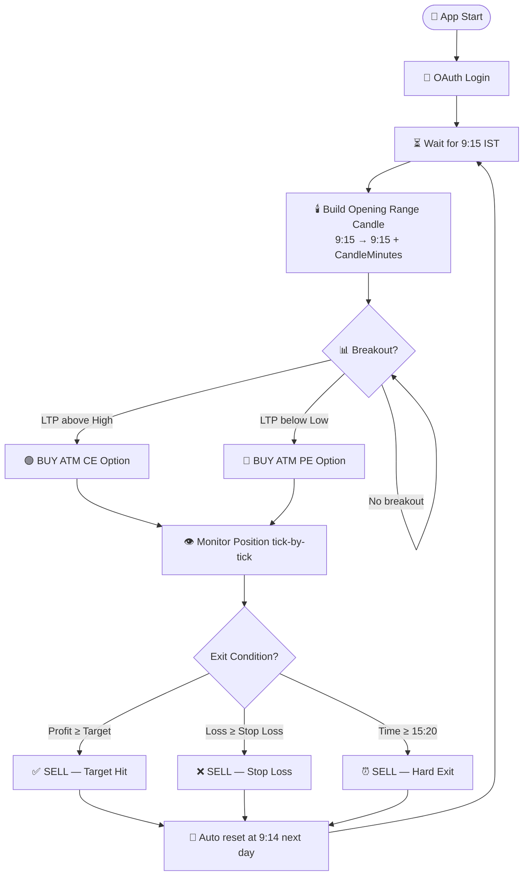
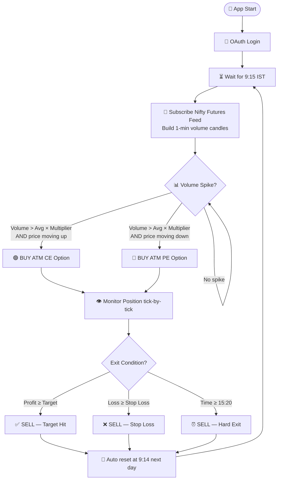
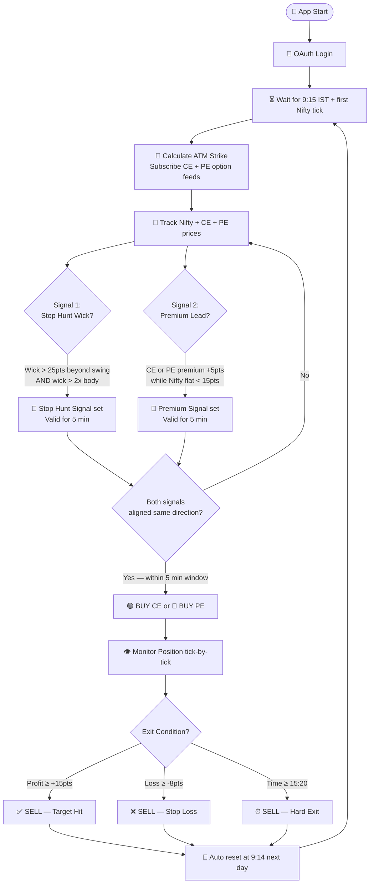

<div align="center">

# 📈 UpstoxTrader

### Automated Multi-Strategy Trading Bot
#### Nifty 50 Options · Upstox API · .NET 8

<br/>


</div>

---

## 📌 What Is This?

UpstoxTrader is a fully automated trading bot that runs **three independent strategies** on Nifty 50 options using the Upstox API. All strategies share a single WebSocket market feed, run in parallel, place market orders, monitor P&L tick-by-tick, and exit automatically — no manual intervention needed.

| # | Strategy | Signal | Log Window |
|---|---|---|---|
| 1 | **ORB** — Opening Range Breakout | Price breaks candle High/Low | 🔵 Cyan |
| 2 | **Volume Breakout** | Futures volume spike on breakout | 🟢 Green |
| 3 | **Premium Stop Hunt** | Premium leads price + wick pattern | 🟣 Magenta |

---

## 🚀 Run Commands

```bash
cd src\UpstoxTrader.Worker

dotnet run              # Run all 3 strategies together
dotnet run -- orb       # Strategy 1 only
dotnet run -- volume    # Strategy 2 only
dotnet run -- premium   # Strategy 3 only
```

> Log monitor windows open automatically for whichever strategies are running.

---

## 🏗️ System Architecture



---

---

# Strategy 1 — Opening Range Breakout (ORB)

## 🔄 How It Works

The bot watches Nifty price for the first N minutes after 9:15. The High and Low of that window form the **Opening Range**. If price breaks out above High → buy CE. Below Low → buy PE.



## 🕯️ Opening Range Candle

```
Nifty Price
    │
    │              ╔══ Breakout Above High → 🟢 BUY CE ══════▶
    │              ║
 High ─────────────╫──────────────────────────────────────────
    │         ┌────╨────┐
    │         │  O R B  │  Opening Range Candle
    │         │  Candle │  tracks High / Low / Open / Close
    │         └────╥────┘
 Low  ─────────────╫──────────────────────────────────────────
    │              ║
    │              ╚══ Breakout Below Low → 🔴 BUY PE ══════▶
    │
    └──────────────────────────────────────────────────────▶ Time
              9:15  9:17                             15:20
              │◄──►│
           CandleMinutes
```

## ⚙️ Configuration

| Key | Default | Description |
|-----|---------|-------------|
| `Trading:CandleMinutes` | `30` | Opening range window in minutes |
| `Trading:CandleMode` | `AllCandles` | `FirstOnly` — one trade per day; `AllCandles` — re-arm after each candle |
| `Trading:SignalCutoffTime` | `"15:00"` | Stop looking for new signals after this time |
| `Trading:LotSize` | `65` | Qty per order |
| `Trading:ExitMode` | `Percent` | `Percent` or `Points` |
| `Trading:TakeProfitPct` | `10.0` | Target % in Percent mode |
| `Trading:StopLossPct` | `5.0` | Stop loss % in Percent mode |
| `Trading:TakeProfitPoints` | `10` | Target pts in Points mode |
| `Trading:StopLossPoints` | `5` | Stop loss pts in Points mode |
| `Trading:HardExitTime` | `"15:20"` | Force-close all positions at this time |
| `Trading:PaperTrade` | `false` | `true` = simulated · `false` = real orders |

## 📋 Key Log Messages

```
[BreakoutWorker]  Breakout detected: CE | Nifty @ 24150
[BreakoutWorker]  Placed BUY order: NSE_FO|NIFTY26JUN24150CE
[PositionMonitor] P&L: +8.2% | ₹5,330
[PositionMonitor] Exit: Target Hit | Sell order placed
```

---

---

# Strategy 2 — Volume Breakout

## 🔄 How It Works

Watches **Nifty Futures volume** alongside price. A genuine breakout is confirmed only when volume spikes above a multiple of the average — filtering out low-conviction moves that would trap ORB signals.



## 📊 Volume Spike Detection

```
Futures Volume (1-min bars)
    │
    │                          ▓▓▓  ← Volume spike
    │                          ▓▓▓    > Avg × VolumeMultiplier
    │              ▓▓▓  ▓▓▓   ▓▓▓      → SIGNAL FIRED
    │   ▓▓▓  ▓▓▓  ▓▓▓  ▓▓▓   ▓▓▓
    │   ▓▓▓  ▓▓▓  ▓▓▓  ▓▓▓   ▓▓▓
    ├── Avg Volume line ──────────────────────────────
    │
    └──────────────────────────────────────────────▶ Time
       9:15  9:16  9:17  9:18  9:19
```

Both conditions must be true at the same time:
- **Volume spike**: current 1-min bar volume > rolling average × `VolumeMultiplier`
- **Price direction**: Nifty LTP moving up (buy CE) or down (buy PE)

## ⚙️ Configuration

| Key | Default | Description |
|-----|---------|-------------|
| `VolumeStrategy:FuturesInstrumentKey` | `NSE_FO\|NIFTY25JUN26FUT` | Current month futures key — update on rollover |
| `VolumeStrategy:VolumeMultiplier` | `2.0` | Spike threshold — current volume must exceed average by this multiple |
| `VolumeStrategy:TakeProfitPoints` | `10` | Target in option premium points |
| `VolumeStrategy:StopLossPoints` | `5` | Stop loss in option premium points |
| `VolumeStrategy:HardExitTime` | `"15:20"` | Force-close at this time |
| `VolumeStrategy:LotSize` | `65` | Qty per order |
| `VolumeStrategy:PaperTrade` | `false` | `true` = simulated · `false` = real orders |

> **Futures key rollover**: Nifty futures expire last Thursday of each month. Update `FuturesInstrumentKey` before the new month begins. Format: `NSE_FO|NIFTY{DD}{MMM}{YY}FUT` e.g. `NSE_FO|NIFTY26JUN26FUT`

## 📋 Key Log Messages

```
[VOL] Futures candle: Vol=124500 Avg=58000 Spike=2.1x → CE signal
[VOL] Placed BUY order: NSE_FO|NIFTY26JUN24200CE
[VOL] P&L: +9pts | ₹585
[VOL] Exit: Take Profit | Sell order placed
```

---

---

# Strategy 3 — Premium Stop Hunt

## 🔄 How It Works

Combines **two independent signals** — both must align within a 5-minute window before entry. This makes it the most selective of the three strategies, targeting situations where smart money is driving options before price reacts.



## 🔔 Signal 1 — Stop Hunt Wick

A single 1-minute Nifty candle spikes beyond the recent swing High/Low and snaps back, leaving a long wick. This pattern shows stop hunts by institutions — they push price to trigger retail stops, then reverse.

```
Nifty 1-min candle (bearish stop hunt example)
                                        │
                    ┌──────────────┐    │ ← Long upper wick
                    │   candle     │    │   > 25 pts above SwingHigh
 SwingHigh ─────────┼──────────────┼────┤
                    │   body       │    │
                    └──────────────┘    │
                                        │
Conditions for BEARISH stop hunt (PE signal):
  upperWick  > StopHuntWickPoints (25 pts)   ← wick reaches beyond swing
  bar.High   > 5-candle SwingHigh            ← actually breaks the level
  upperWick  > 2 × body                      ← wick dominates, not a trend candle
```

```
Nifty 1-min candle (bullish stop hunt example)
                    ┌──────────────┐
                    │   body       │
 SwingLow  ─────────┼──────────────┼────┤
                    │              │    │ ← Long lower wick
                    └──────────────┘    │   > 25 pts below SwingLow
                                        │
Conditions for BULLISH stop hunt (CE signal):
  lowerWick  > StopHuntWickPoints (25 pts)
  bar.Low    < 5-candle SwingLow
  lowerWick  > 2 × body
```

## 📈 Signal 2 — Premium Leads Price

Option premium starts rising **before** Nifty moves. This is smart money accumulating positions — they know direction before it shows in the index.

```
Time window: last 3 minutes
─────────────────────────────────────────────────────
Nifty LTP:   24200 → 24208 → 24205  (flat, < 15 pts move)
CE Premium:    120  →   125 →   128  (rose +8 pts)
                                          ↑ Premium leads!
→ CE Premium Signal fired
─────────────────────────────────────────────────────
```

## ⚡ Entry — Both Signals Must Align

```
Timeline example:
09:22  Stop Hunt (bullish wick) detected    → StopHunt CE signal ✅
09:24  CE premium rises +5pts, Nifty flat   → Premium CE signal ✅
09:24  Both CE signals within 5-min window  → BUY CE option ← ENTRY
09:35  CE premium +16pts from entry         → SELL → Target Hit ✅
```

If only one signal fires, or they point in opposite directions — no trade.

## 🔄 ATM Strike Management

The worker automatically tracks the ATM (At-The-Money) strike throughout the day:

- **At startup**: Calculates ATM from first Nifty tick, subscribes CE + PE feeds via option chain API
- **Every 30 min**: Re-fetches ATM keys to catch any option chain changes
- **On 75-pt drift**: If Nifty moves 75+ pts from current ATM strike, refreshes immediately
- **On refresh**: Old CE/PE price history is cleared, new keys subscribed

## ⚙️ Configuration

| Key | Default | Description |
|-----|---------|-------------|
| `PremiumStopHunt:StopHuntWickPoints` | `25.0` | Minimum wick size beyond swing to count as a stop hunt |
| `PremiumStopHunt:PremiumRisePoints` | `5.0` | Minimum CE or PE premium rise (in pts) in the lookback window |
| `PremiumStopHunt:NiftyFlatPoints` | `15.0` | Nifty must have moved less than this during the lookback |
| `PremiumStopHunt:PremiumLookbackMinutes` | `3` | Rolling window to measure premium change |
| `PremiumStopHunt:SignalWindowMinutes` | `5` | Both signals must fire within this window to trigger entry |
| `PremiumStopHunt:TakeProfitPoints` | `15.0` | Target profit in option premium points |
| `PremiumStopHunt:StopLossPoints` | `8.0` | Stop loss in option premium points |
| `PremiumStopHunt:HardExitTime` | `"15:20"` | Force-close at this time |
| `PremiumStopHunt:LotSize` | `65` | Qty per order |

## 📋 Key Log Messages

```
[PSH] Waiting for first Nifty tick...
[PSH] Refreshing ATM subscription | Nifty:24450 ATM:24450
[PSH] ATM subscribed | CE:NSE_FO|NIFTY26JUN24450CE PE:NSE_FO|NIFTY26JUN24450PE

[PSH] STOP HUNT BULLISH | Wick:28.5pts below SwingLow:24380 Body:6.0
[PSH] PREMIUM SIGNAL CE  | CE +6.2pts | Nifty flat (9.5pts)
[PSH] BOTH SIGNALS ALIGNED → CE — entering trade
[PSH] Placed BUY order: NSE_FO|NIFTY26JUN24450CE

[PSH] Entry price set from first tick: 142.50
[PSH] Take profit triggered: +15.3pts
[PSH] Position closed | Take Profit (+15.3pts) | PnL: ₹994.50
```

---

---

## ⚙️ Prerequisites

| Requirement | Details |
|---|---|
| [.NET 8 SDK](https://dotnet.microsoft.com/download/dotnet/8.0) | Download the **SDK** (not Runtime) for Windows x64 |

Verify after install:
```bash
dotnet --version   # should print 8.x.x
```

---

## 🚀 Setup Guide

### Step 1 — Upstox Developer Portal

1. Log in at [developer.upstox.com](https://developer.upstox.com)
2. Go to **My Apps** → **Create New App**
3. Set the **Redirect URL** to exactly: `http://localhost:5000/callback/`
4. Enable scopes: `orders` `portfolio` `feed` `user`
5. Copy your **Client ID** and **Client Secret**

### Step 2 — Configure

Open `src\UpstoxTrader.Worker\appsettings.json`:

```json
"Upstox": {
  "ClientId":     "YOUR_CLIENT_ID",
  "ClientSecret": "YOUR_CLIENT_SECRET",
  "RedirectUri":  "http://localhost:5000/callback/"
}
```

### Step 3 — Run

```bash
cd src\UpstoxTrader.Worker
dotnet run
```

First run downloads packages automatically. A browser opens for Upstox login. After approval, the bot starts and waits for 9:15 IST.

---

## 📄 Paper vs Live Trading

| | 🧪 Paper | 💰 Live |
|---|---|---|
| `PaperTrade` | `true` | `false` |
| Real orders placed | No | Yes |
| P&L tracking | Simulated from ticks | Real |
| Logs | Same | Same |

> ⚠️ **Always run Paper first** to confirm signals fire correctly before going live.

Each strategy has its own `PaperTrade` setting — you can paper-trade Strategy 3 while Strategies 1 and 2 run live.

---

## 📁 Solution Structure

```
UpstoxTrader/
├── README.md
├── UpstoxTrader.sln
└── src/
    ├── UpstoxTrader.Core/
    │   ├── Models/          ORBState · VolumeBreakoutState · PremiumStopHuntState · Position
    │   ├── Interfaces/      IOrderService · IOptionChainService · IMarketFeedService
    │   ├── Settings/        TradingSettings · VolumeStrategySettings · PremiumStopHuntSettings
    │   └── Enums/           OptionType · TradeDirection · PositionStatus
    ├── UpstoxTrader.Infrastructure/
    │   ├── Auth/            TokenManager · TokenService (OAuth)
    │   ├── WebSocket/       UpstoxWebSocketClient (Protobuf feed)
    │   ├── Http/            UpstoxHttpClient
    │   └── Services/        UpstoxOrderService · UpstoxOptionChainService · FuturesCandleService
    ├── UpstoxTrader.Strategy/
    │   ├── ORBCandleBuilder · BreakoutDetector · ExitEvaluator
    │   └── FuturesCandleService · ATMCalculator
    └── UpstoxTrader.Worker/
        ├── Workers/
        │   ├── MarketDataWorker          — WebSocket feed · tick fan-out to all channels
        │   ├── BreakoutWorker            — Strategy 1 signal detection
        │   ├── PositionMonitorWorker     — Strategy 1 exit management
        │   ├── VolumeBreakoutWorker      — Strategy 2 signal detection
        │   ├── VolumePositionMonitorWorker — Strategy 2 exit management
        │   ├── PremiumStopHuntWorker     — Strategy 3 signal + position management
        │   └── DailyResetWorker          — Resets all strategies at 9:14 IST
        ├── Watch-ORB.ps1      — Live log tail for Strategy 1
        ├── Watch-Volume.ps1   — Live log tail for Strategy 2
        ├── Watch-Premium.ps1  — Live log tail for Strategy 3
        └── appsettings.json
```

---

## ⚠️ Important Notes

- Each person must use their **own Upstox API credentials** — never share across machines
- All state is **in-memory** — restarting mid-day resets all strategies
- If started **after 9:30 IST**, Strategy 1 auto-seeds the opening candle from historical data
- Strategy 2 futures key must be updated manually each month on rollover
- Strategy 3 ATM is refreshed automatically throughout the day
- Press `Ctrl+C` to stop all strategies cleanly

---

<div align="center">

Built with ❤️ using .NET 8 · Not financial advice · Trade responsibly

</div>
