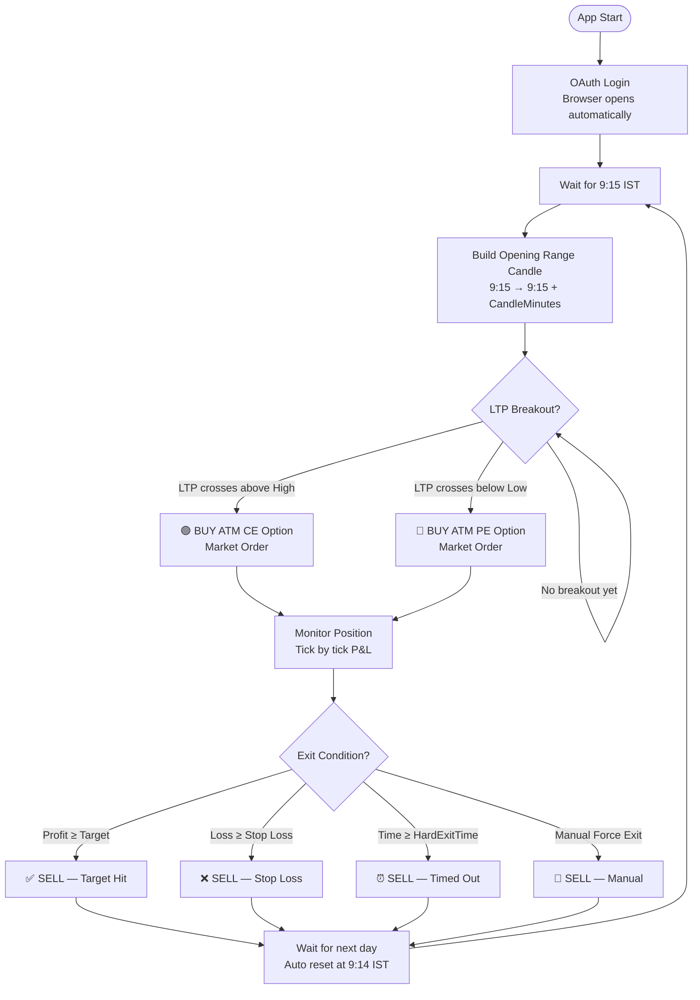
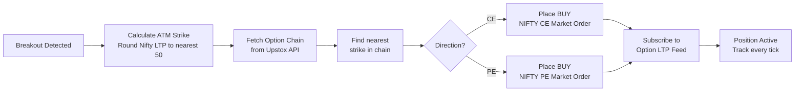
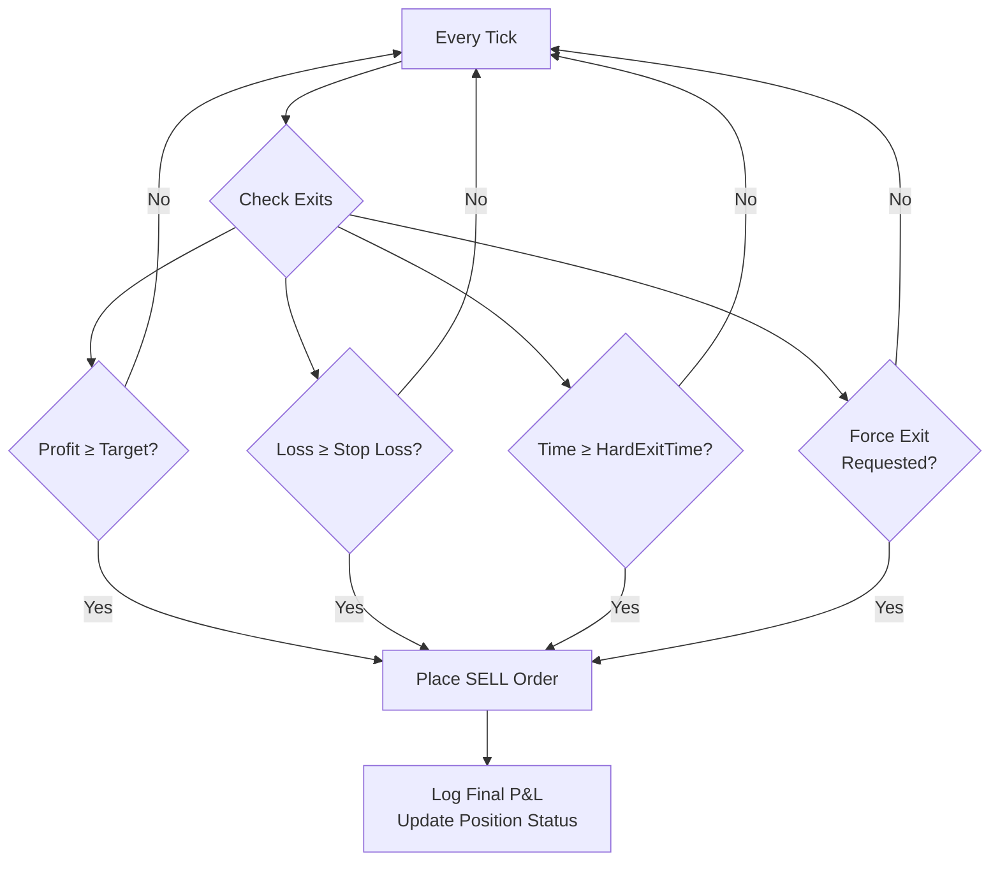
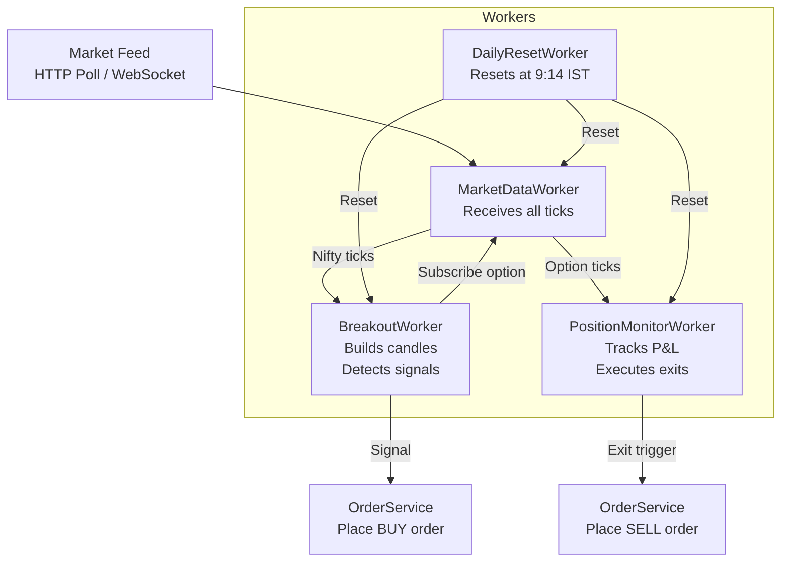

# UpstoxTrader — ORB Strategy Bot

Opening Range Breakout (ORB) trading automation for Nifty 50 options, built on .NET 8.
Pure Worker Service — all output goes to the console and rolling log files.

---

## How It Works

### Overall Trading Flow



---

### The Opening Range Candle

The bot watches Nifty price for the first N minutes (configurable). Whatever the High and Low are during that window becomes the **Opening Range**.

```
Nifty Price
    │
    │         ╔══ CE Signal → BUY CE ══════════════▶
    │         ║
 High ────────╫──────────────────────────────────────
    │    ┌────╨────┐
    │    │         │   Opening Range Candle
    │    │  9:15   │   (High, Low, Open, Close)
    │    │ to 9:17 │
    │    └────╥────┘
 Low  ────────╫──────────────────────────────────────
    │         ║
    │         ╚══ PE Signal → BUY PE ══════════════▶
    │
    └──────────────────────────────────────────────▶ Time
         9:15  9:17          9:30           15:20
```

---

### Order Placement Logic



---

### Exit Conditions



**Exit modes:**

| `ExitMode` | Target condition | Stop loss condition |
|---|---|---|
| `Percent` | `(LTP - Entry) / Entry × 100 ≥ TakeProfitPct` | `(Entry - LTP) / Entry × 100 ≥ StopLossPct` |
| `Points` | `LTP - Entry ≥ TakeProfitPoints` | `Entry - LTP ≥ StopLossPoints` |

---

### System Architecture



---

## Prerequisites

- [.NET 8 SDK](https://dotnet.microsoft.com/download/dotnet/8.0) — install the **SDK** (not Runtime) for Windows x64

Verify after install:
```
dotnet --version
```
Should print `8.x.x`. No other software is required.

---

## Step 1 — Upstox Developer Portal Setup (One-Time)

1. Log in at [developer.upstox.com](https://developer.upstox.com)
2. Go to **My Apps** → **Create New App**
3. Set the **Redirect URL** to exactly:
   ```
   http://localhost:5000/callback/
   ```
4. Enable these scopes: `orders`, `portfolio`, `feed`, `user`
5. Note your **Client ID** and **Client Secret**

---

## Step 2 — Get the Code

Download the ZIP from GitHub → **Code → Download ZIP** and extract to any folder, e.g. `C:\UpstoxTrader`.

---

## Step 3 — Configure

Open `src\UpstoxTrader.Worker\appsettings.json` and fill in your credentials:

```json
"Upstox": {
  "ClientId":     "YOUR_CLIENT_ID",
  "ClientSecret": "YOUR_CLIENT_SECRET",
  "RedirectUri":  "http://localhost:5000/callback/"
}
```

See the full **Configuration Reference** below for all trading parameters.

---

## Step 4 — Run

```bash
cd src\UpstoxTrader.Worker
dotnet run
```

On first run:
1. NuGet packages are downloaded automatically (requires internet, one-time only)
2. A browser window opens for Upstox OAuth login
3. After you approve, the bot starts and waits for market open

All output goes to the console and to `logs/upstox-YYYYMMDD.log`.

---

## Configuration Reference

All settings live in `src\UpstoxTrader.Worker\appsettings.json`.

### Upstox API

| Key | Description |
|-----|-------------|
| `Upstox:ClientId` | From Upstox developer portal |
| `Upstox:ClientSecret` | From Upstox developer portal |
| `Upstox:RedirectUri` | Must match exactly what is set in developer portal |
| `Upstox:BaseUrl` | `https://api.upstox.com/v2` — do not change |
| `Upstox:WebSocketUrl` | Upstox market feed URL — do not change |

### Trading

| Key | Default | Description |
|-----|---------|-------------|
| `Trading:CandleMinutes` | `2` | Opening range window in minutes (e.g. `2` = 9:15–9:17) |
| `Trading:CandleMode` | `AllCandles` | `FirstOnly` — trade only the first candle signal; `AllCandles` — re-arm after each candle |
| `Trading:SignalCutoffTime` | `"15:00"` | In `AllCandles` mode, stop looking for new signals after this IST time |
| `Trading:LotSize` | `75` | Shares per order — check NSE for current Nifty lot size |
| `Trading:ExitMode` | `Percent` | `Percent` — exit based on % move; `Points` — exit based on absolute points |
| `Trading:TakeProfitPct` | `10.0` | Target profit % (used when `ExitMode` is `Percent`) |
| `Trading:StopLossPct` | `5.0` | Stop loss % (used when `ExitMode` is `Percent`) |
| `Trading:TakeProfitPoints` | `10` | Target profit in points (used when `ExitMode` is `Points`) |
| `Trading:StopLossPoints` | `5` | Stop loss in points (used when `ExitMode` is `Points`) |
| `Trading:HardExitTime` | `"15:20"` | Force-exit any open position at this IST time |
| `Trading:PaperTrade` | `true` | `true` = simulated, no real orders; `false` = live trading |

### Nifty

| Key | Default | Description |
|-----|---------|-------------|
| `Nifty:InstrumentKey` | `NSE_INDEX\|Nifty 50` | Upstox instrument key — do not change |
| `Nifty:StrikeInterval` | `50` | Strike rounding interval — Nifty uses 50 |

---

## Paper Trading vs Live Trading

| | Paper | Live |
|---|---|---|
| `PaperTrade` | `true` | `false` |
| Real orders placed | No | Yes |
| P&L tracking | Yes (simulated from ticks) | Yes (real) |
| Logs | Same | Same |

**Always run with `PaperTrade: true` first** to confirm the bot is selecting the correct expiry, strike, and direction before switching to live.

To go live:
1. Set `"PaperTrade": false` in `appsettings.json`
2. Verify `LotSize`, `TakeProfitPct`, and `StopLossPct`
3. Restart the bot

---

## Logs

Rolling daily logs are written to `logs/upstox-YYYYMMDD.log` in the working directory.
Console output uses the same format: `[HH:mm:ss INF] Message`.

Key log lines on startup:
```
Opening browser for Upstox OAuth...
Access token obtained — ready to trade
Option chain session: underlying=NSE_INDEX|Nifty 50 expiry=2026-05-13
```

Key log lines during trading:
```
Breakout detected: CE | Nifty @ 24150
Placed BUY order: NSE_FO|NIFTY...
P&L: +6.2% | ₹4,800
Exit: Target Hit | Sell order placed
```

---

## Solution Structure

```
UpstoxTrader/
├── README.md
├── UpstoxTrader.sln
└── src/
    ├── UpstoxTrader.Core/            Models, interfaces, settings, enums
    ├── UpstoxTrader.Infrastructure/  Auth, WebSocket, HTTP client, order and option services
    ├── UpstoxTrader.Strategy/        Candle builder, breakout detector, exit evaluator
    └── UpstoxTrader.Worker/          Background workers, startup, appsettings.json
```

---

## Important Notes

- Each person must use their **own Upstox API credentials** — do not share credentials across machines
- The bot handles **one position per day** in `FirstOnly` mode
- In `AllCandles` mode only one position is active at a time; it re-arms after the position is closed
- All state is **in-memory** — restarting mid-day resets everything
- The bot runs until you press `Ctrl+C`
